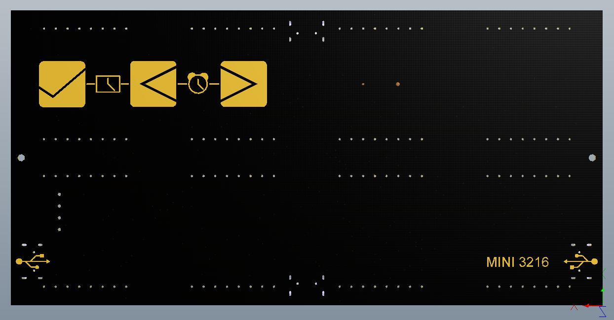

# MINI 3216 电子时钟

[](https://github.com/smcdef/Mini-3216/blob/master/LICENSE)
[](https://github.com/smcdef/Mini-3216/releases)
[](https://github.com/smcdef/Mini-3216/pulls)
[](https://github.com/smcdef/Mini-3216/pulls)
[](https://github.com/smcdef/Mini-3216/commits/master)
[](https://github.com/smcdef/Mini-3216/stargazers)
[](https://github.com/smcdef/Mini-3216/network/members)


还记得5年前（2014年）刚入门51单片机的时候的学习场景。当年单片机的学习之路是跟着杜洋的《爱上单片机》一书学习。如今这本书都已经出到第四版了（推荐一下这本书，还是很不错的，图片和制作都很用心）。那时候就很喜欢这本书里面的电子制作。杜老师有很多的电子DIY作品，唯一让我感兴趣的就是Mini 3216。这是一个电子时钟。非常的有意思。刚学习单片机的时候就励志以后一定也做个一模一样的时钟(当年的志向就是那么的简单)。

但是当我真的开始琢磨时，发现事情并不是那么的简单。如此简单的电路是如何使用单片机的32个IO驱动 32 x 16 点阵的呢？我们知道32个IO口驱动点阵的极限是16x16点阵。很是好奇，经过自己的琢磨终于想明白了原理。我们使用32个IO口连接16x16点阵，则没有任何问题。另外16x16点阵如何处理呢？反接吧！描述的不清还是看下原理图。如果下面的原理图依然看不明白，就看下PDF的原理图（pcb/mini3216时钟V3.0.PDF）。硬件虽然是连接起来了，软件又该如何处理呢？STC单片机的IO口可以设置4种模式，分别是：普通IO、推挽输出、高祖输入和开漏。为了让一个LED的亮度正常显示，我们利用推挽输出20mA电流驱动LED。为了驱动的时候不影响其他的LED，我们还需要将不需要点亮的LED的IO口设置开漏模式。这样就OK了。

```txt
        P0 <--------+------------+
                    |   +-----+  |   +-----+
                    +---+  0  |  +---+  2  |
                        +--+--+      +--+--+
                           |            |
          +----------------+            +-------+
          |                                     |
          |  P2 <---+------------+              |
          |         |   +-----+  |   +-----+    |
          |         +---+  1  |  +---+  3  |    |
          |             +--+--+      +--+--+    |
          |                |            |       |
          +----------------+            +-------+
          |                                     |
          v                                     v
          P3                                    P4


         P3 <-------+------------+
                    |   +-----+  |   +-----+
                    +---+  4  |  +---+  6  |
                        +--+--+      +--+--+
                           |            |
          +----------------+            +-------+
          |                                     |
          |  P4 <---+------------+              |
          |         |   +-----+  |   +-----+    |
          |         +---+  5  |  +---+  7  |    |
          |             +--+--+      +--+--+    |
          |                |            |       |
          +----------------+            +-------+
          |                                     |
          v                                     v
          P0                                    P2
```

关注这款时钟实现原理的朋友，好奇的问题一定是如何驱动 32 x 16 点阵。这部分代码实现位于core/fb_core.c文件。

于是就开始了自己的DIY之旅。虽然很多年过去了，Mini 3216已经陪伴了我4个春秋。摆在电脑旁边，也是一种享受。整点时刻会小声滴滴几下，提醒着我时间的流逝。有人说电脑右下角不是有时间嘛！是啊！就当我近似看不清，我就是喜欢字体大点的😄。

而现在我依稀发现，网上还是没有人公开原理（可能感兴趣的人不多）。虽然大学毕业后并没有从事单片机行业，但是依然保持对单片机的热爱。也由于自己工作接触的软件多为开源软件。因此，自己也有一颗开源的心。希望分享给更多的人。

## 优点

1. 所有元器件都在PCB top layout，最终焊接后都会藏在点阵屏下面，美观简介。
2. 高精度时钟芯片DS3231SN，一年误差30秒之内（数据来自DS3231 Datasheet），时间更精准。
3. 支持 -20℃~60℃环境温度显示。
4. 全方位检测环境光强，环境暗时，自动降低亮度（3级亮度自动调节）。
5. 上下左右4个Micro USB接口，方便供电。
6. 具有整点报时功能，报时声音采用新闻联播7:00开始前的多段声音报时。
7. 具有独特重力换向功能，不止可以正着放，还可以倒着放，显示内容总是正向的（想象你的手机横屏功能）。
8. 内置备用电池可保证断电后上电时间依然正确。
9. 背面3个触摸按键，看起来就很高大上。
10. 主界面显示时间，每8s切换显示2s温度（如果你愿意，显示流动显示日期也不是问题啊）。
11. 5v, 40mA工作电流。粗略计算，不断电使用7个月消耗1度电。
12. 源码公开，可以愉快的DIY了。你得天下你做主。

## 效果展示

我个人是集齐了红、蓝、白、橙、绿等几种颜色。总得效果来说各个颜色都挺好看。各有特色。附上两张蓝色显示效果图。


硬件经过几次改版，现在的硬件具有上下左右4个micro USB口，方便供电。上下左右4个光敏电阻全方位检测环境光强。背面3个触摸按键。PCB top layout 和 bottom layout 展示如下图所示。




## 元器件清单

| 元器件                                                       | 数量 |
| :----------------------------------------------------------- | ---: |
| 47uF 0805电容                                                |    1 |
| 10nF 0805电容                                                |    1 |
| 100nF 0805电容                                               |    4 |
| CR1220                                                       |    1 |
| CR1220电池座                                                 |    1 |
| [平口micro USB](https://item.taobao.com/item.htm?spm=a1z09.2.0.0.56db2e8d9M883Y&id=563928996432&_u=o1ltpbj55c9c) |    4 |
| [圆孔单排排母](https://item.taobao.com/item.htm?spm=a1z10.3-c.w4002-21261304145.10.1f211f35uFoswJ&id=564032495761) |    4 |
| [SW-520D倾角开关](https://detail.tmall.com/item.htm?id=580815564872&spm=a1z09.2.0.0.56db2e8d9M883Y&_u=o1ltpbj5179b) |    1 |
| 10k 欧姆0805电阻                                             |    2 |
| 100 欧姆0805电阻                                             |    1 |
| 22pF 0805电容                                                |    3 |
| LM75温度传感器                                               |    1 |
| [BS813A触摸芯片](https://item.taobao.com/item.htm?spm=a1z09.2.0.0.56db2e8d9M883Y&id=36285536377&_u=o1ltpbj5139d) |    1 |
| PNP S8550三极管                                              |    1 |
| 光敏电阻5506                                                 |    4 |
| DS3231SN时钟芯片                                             |    1 |
| [KLJ-9032蜂鸣器](https://item.taobao.com/item.htm?spm=a1z09.2.0.0.56db2e8d9M883Y&id=564040278829&_u=o1ltpbj5673d) |    1 |
| [32mm 共阳点阵（上下各8个引脚，引脚间距2.54mm）](https://item.taobao.com/item.htm?spm=a1z09.2.0.0.56db2e8d9M883Y&id=573348473815&_u=o1ltpbj52711) |    8 |
| STC15F2K60S2单片机                                           |    1 |
| [1x4单排排母（下载接口使用）](https://item.taobao.com/item.htm?spm=a1z10.3-c.w4002-21261304145.9.51231f35z1KhNQ&id=563776620907) |    1 |

## 技术规格

工作电压：DC 5V

工作电流：40mA

功      率：0.2W（低功耗）

外形尺寸：128x11x64 mm

工作温度：-20℃~60℃

点阵型号：F3.0  1388点阵

## 更新说明

1. PCB由BS814A更改为BS813A（代码配置CONFIG_BS813A）。
2. 增加DS3231中断引脚连接。
3. 光敏电阻一端增加10k上拉电阻。

## 注意事项

1. 单片机使用的是STC15F2K60S2，使用内部晶振
2. 下载时，晶振频率请选择27MHz
3. 初次构建Keil工程后，请如下设置。
    - 快捷键**Alt+F7**进入Options for Target ‘Target 1’设置界面。
    - 点击**Device**选项框，勾选**Use Extended Linker(LX51) instead of BL51**。
    - 点击**LX51 Misc**选项框，在Misc controls输入栏填写**REMOVEUNUSED**。
    - 点击**OK**，设置完成。
4. 默认情况下，初次下载程序后，当断开主电源后DS3231默认不工作（备份电池省电，可以不使用后长时间放置）。当需要使用时候，需要按下背部3个按键。因此，当你发现断电后下次上电时间没有保存，请先按下3个按键尝试设置。如果设置不起效，可能原因是纽扣电池没电了，请更换电池。
5. 如果你是用Mac烧写单片机，可以选择stcgal工具。运行命令： `make flash`
6. 强烈建议使用Keil C51编译源码，实测发现Keil C51对代码的优化效果远好于SDCC。hex目录下已经为你准备一份Keil C51编译的hex镜像。
